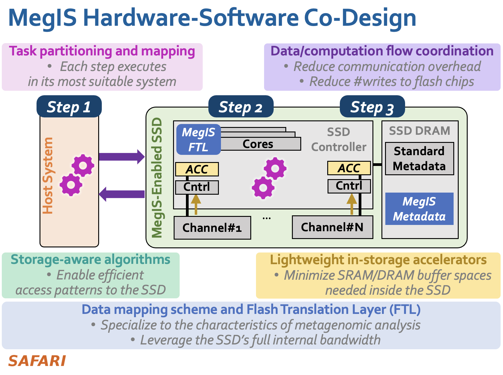

# MegIS: High-Performance, Energy-Efficient, and Low-Cost Metagenomic Analysis with In-Storage Processing

## What is MegIS?

MegIS is the first in-storage processing system designed to significantly reduce the data movement overhead of the end-to-end metagenomic analysis pipeline. MegIS is enabled by our lightweight design that effectively leverages and orchestrates processing inside and outside the storage system. We address in-storage processing challenges for metagenomics via specialized and efficient 1) task partitioning, 2) data/computation flow coordination, 3) storage technology-aware algorithmic optimizations, 4) data mapping, and 5) lightweight in-storage accelerators. MegIS's design is flexible, capable of supporting different types of metagenomic input datasets, and can be integrated into various metagenomic analysis pipelines.  


<p align="center">
  
</p>


## Citation
If you find this repo useful, please cite the following paper:

Nika Mansouri Ghiasi, Mohammad Sadrosadati, Harun Mustafa, Arvid Gollwitzer, Can Firtina, Julien Eudine, Haiyu Mao, Joël Lindegger, Meryem Banu Cavlak, Mohammed Alser, Jisung Park, Onur Mutlu,
["MegIS: High-Performance, Energy-Efficient, and Low-Cost Metagenomic Analysis with In-Storage Processing"](https://arxiv.org/pdf/2406.19113)
ACM/IEEE 51st Annual International Symposium on Computer Architecture (ISCA), 2024.

```bibtex
@inproceedings{ghiasi2024megis,
  title={MegIS: High-Performance, Energy-Efficient, and Low-Cost Metagenomic Analysis with In-Storage Processing},
  author={Ghiasi, Nika Mansouri and Sadrosadati, Mohammad and Mustafa, Harun and Gollwitzer, Arvid and Firtina, Can and Eudine, Julien and Mao, Haiyu and Lindegger, Jo{\"e}l and Cavlak, Meryem Banu and Alser, Mohammed and Park, Jisung and Mutlu, Onur},
  booktitle={2024 ACM/IEEE 51st Annual International Symposium on Computer Architecture (ISCA)},
  pages={660--677},
  year={2024},
  organization={IEEE}
}
```

## Table of Contents

  * [What is MegIS?](#what-is-megis-)
  * [Citation](#citation)
  * [Prerequisites](#prerequisites)
  * [Input Data](#input-data)
    + [Query Read Sets](#query-read-sets)
    + [Database](#database)
  * [Preparing the Input Queries](#preparing-the-input-queries)
  * [Finding Candidate Species](#finding-candidate-species)
  * [End-to-end Throughput](#end-to-end-throughput)
  * [Contact](#contact)


## Prerequisites

The infrastructure has been tested with the following system configuration:
  * g++ v11.1.0
  * Python v3.9.12

Prerequisites specific to each experiment are listed in their respective subsections.


## Input Data

### Query Read Sets

The read sets used in the paper are from the commonly-used [CAMI benchmark](https://www.nature.com/articles/nmeth.4458). They can be obtained from [this link](http://gigadb.org/dataset/100344).

### Database

In our paper, we generate a database based on microbial genomes drawn from NCBI’s databases, including 155,442 genomes for 52,961 microbial species. You can download the genomes by running the script `input-data/download_genomes.sh`. This also creates a list of the files in `input-data/database_genomes.txt`.

After compiling KMC, build the database from the input files by running the following commands
```bash
# create a local scratch directory
mkdir -p kmc_tmp

# create an initial database
kmc -k60 -fa -ci0 -cs3 -t$NUM_THREADS @input-data/database_genomes.txt ${OUT_FILE}_pre kmc_tmp

# sort k-mers in the database
kmc_tools transform ${OUT_FILE}_pre sort $OUT_FILE

# remove the initial database and the scratch directory
rmdir kmc_tmp
rm ${OUT_FILE}_pre
```
replacing `$OUT_FILE` with the desired output name and `$NUM_THREADS` with the desired number of CPU threads.

## Preparing the Input Queries

To extract k-mers from input queries, MegIS includes a new input processing scheme by improving upon the input processing scheme in [KMC](https://github.com/refresh-bio/KMC). MegIS enables overlapping the k-mer sorting and transfer of a bucket to the SSD with the in-storage processing operations of the [next step](#finding-candidate-species) on the previously transferred buckets. The overlapping of different pipeline stages is modeled in the `pipeline/pipeline_throughput.py`. 

In `preparing-input-queries`, we include an optimized version of KMC as a software baseline. This version improves execution time by utilizing a fixed prefix length for query and database k-mers. For a fair comparison, we apply the same optimization (excluding the in-storage processing overlap used in MegIS) when evaluating the baseline software tool, A-Opt, in our experiments.

To prepare a query, run the following commands
```bash
# create a local scratch directory
mkdir -p kmc_tmp

# create an initial k-mer counter
kmc -k60 -fq -ci2 -cs3 -t$NUM_THREADS $IN_FILE ${OUT_FILE}_pre kmc_tmp

# sort k-mers in the k-mer counter
kmc_tools transform ${OUT_FILE}_pre sort $OUT_FILE

# remove the initial k-mer counter and the scratch directory
rmdir kmc_tmp
rm ${OUT_FILE}_pre
```
replacing `$IN_FILE` with the path to the input query file, `$OUT_FILE` with the desired output name, and `$NUM_THREADS` with the desired number of CPU threads. If the input file is in FASTA format, use the `-fa` flag when creating the initial k-mer counter.

## Finding Candidate Species


MegIS runs this step with in-storage process accelerators. The Verilog implementations of MegIS's lightweight hardware units are in `hdl/`. 

To ensure a fair comparison with software baselines, we incorporate optimizations that enhance the utilization of the SSD's I/O bandwidth during the process of identifying intersecting k-mers in software. We include the optimized implementation for intersection finding in `finding-candidate-species/` and use this optimization when evaluating the A-Opt baseline. Given a database `$DB_FILE` and query `$QUERY_FILE` (both excluding the `.kmc_suf` extension), their intersection can be computed using the `intersection` executable in `finding-candidate-species`. It may be compiled by running `make` in its directory. Afterwards, compute an intersection as follows
```bash
intersection $DB_FILE $QUERY_FILE $NUM_THREADS $INTERSECTION_OUT
```
where `$NUM_THREADS` is the desired number of threads and `$INTERSECTION_OUT` is the name of the output.

## End-to-End Throughput

To find the end-to-end throughput of the `pipeline`, we incorporate the latency and throughput of all of MegIS's components, including host operations, accessing flash chips, internal DRAM, in-storage accelerator, and host-SSD interfaces. 

For the components in the hardware-based steps (e.g., [Finding Candidate Species](#finding-candidate-species)): We implement MegIS’s logic components in Verilog, as explained above. We use two state-of-the-art simulators,
[Ramulator](https://github.com/CMU-SAFARI/ramulator) to model SSD’s internal DRAM, and [MQSim](https://github.com/CMU-SAFARI/MQSim) to model SSD’s internal operations. 

For the components in the software-based step (e.g., host operations for [Preparing the Input Queries](#preparing-the-input-queries)), we measure performance on a real system (an AMD® EPYC® 7742 CPU with 128 physical cores and 1-TB DRAM). For the software baselines, we measure performance on this real system, with best-performing thread counts. 


## Contact

Nika Mansouri Ghiasi - n.mansorighiasi@gmail.com
